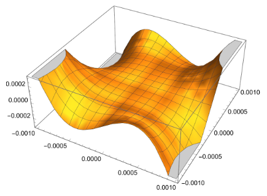
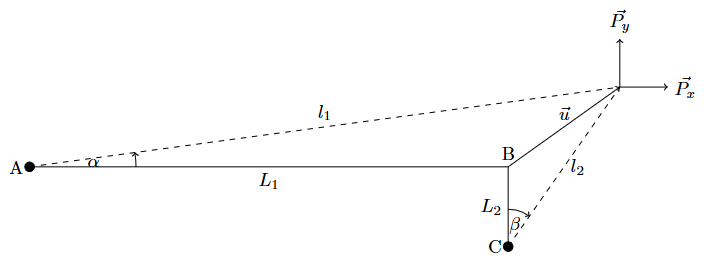
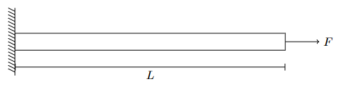
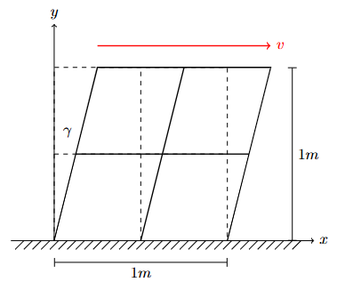
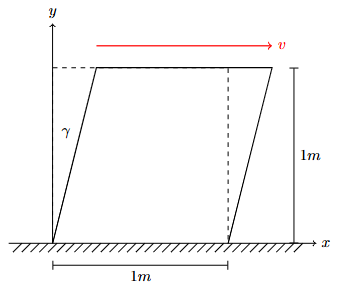
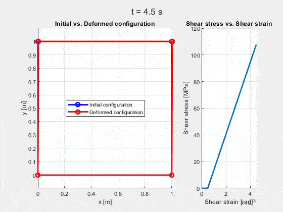

# Advanced Finite Element Methods

A collection of `MATLAB` scripts, covering advanced `FEM` topics from non-linear analysis to plasticity.

    
     
    <figcaption>Error Analysis of Different Non-Linear Models in Assignment 01</figcaption>

## Background

This repository contains the projects and assignments completed for the ME621 course at the University of Waterloo.
The goal of the course was to provide a deep dive into the theoretical and computational aspects of advanced finite element methods.
Each assignment tackled a progressively more complex topic, building upon the fundamentals of structural mechanics and numerical methods.

## Overview

The repository is structured by assignment, with each folder representing a self-contained project.
Common `MATLAB` functions used across assignments are stored in a separate `functions/` directory.
For each assignment, a comprehensive report (`Report.pdf`) is provided, detailing the theoretical background, implementation details, and results.

#### Assignment 01

Non-Linear Analysis of a 2D Truss System using Newton-Raphson Method.

The core focus of this assignment is analyzing the non-linear behavior of a truss structure under large displacements.
Different models with increasing Taylor expansion orders are compared against the exact non-linear solution to evaluate their accuracy and computational efficiency.

    
     
    <figcaption>2D Truss System Analyzed in Assignment 01</figcaption>

#### Assignment 02

Complete 1D Bar Finite Element Analysis with 4-Node Elements.

This project implements a linear finite element analysis of a 1D bar using an explicit integration scheme with a Total Lagrangian formulation.
Shape functions, elemental matrices, and global matrices are derived and assembled to solve for displacements under a given load using 4-node elements.

    
     
    <figcaption>1D Bar Finite Element Analyzed in Assignment 02</figcaption>

#### Assignment 03

Analysis of 2D Plane Stress Problems.

This assignment extends the finite element analysis to 2D plane stress problems using 4-node quadrilateral elements.
It involves simulating simple shear loading on an aluminum specimen using an Updated Lagrangian formulation to analyze stress evolution and node displacement.

    
     
    <figcaption>2D Plane Stress Problem Analyzed in Assignment 03</figcaption>

#### Assignment 04

Elastic-Plastic Stress Update Algorithm.

This assignment focuses on implementing a custom elastic-plastic stress update algorithm for simple shear deformation.
It utilizes the Radial Return algorithm for Von Mises plasticity with isotropic hardening, operating independently of the finite element geometry to simulate computational plasticity similar to a commercial UMAT subroutine.

    
     
    <figcaption>Elastic-Plastic Stress Update Analyzed in Assignment 04</figcaption>

## Quick Start

To run any of the assignments, add the `functions/` directory to your MATLAB path, navigate to the respective assignment directory and execute the `Main.m` script.

Dependencies on external toolboxes are minimal if not null.

## Results

The primary output for each assignment is the detailed `Report.pdf` file, which contains the theoretical background, methodology, results, and discussion.
A key result from the final assignment on **J2 plasticity** is shown below, illustrating the material's behavior under a loading and unloading cycle.

    
     
    <figcaption>J2 Plasticity Loading-Unloading Cycle from Assignment 04</figcaption>

Have a nice coding day,

Tommaso :panda_face:
